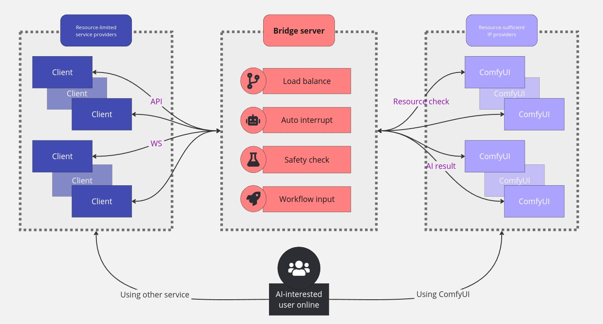
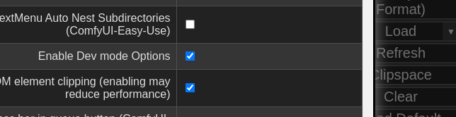
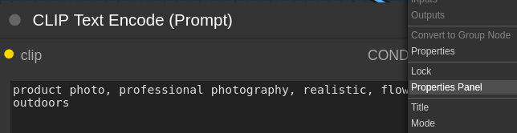
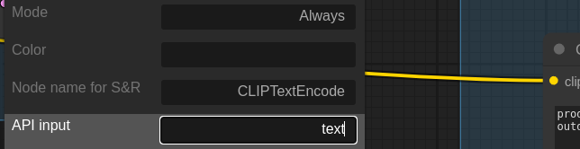
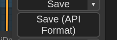

# 🎨 Bridge-server-for-ComfyUI

여러 ComfyUI를 통합하고 workflow를 배포할 수 있는 브릿지(프록시) 서버입니다.

## 📌 Index

- [Introduction](#-introduction)
- [Features](#-features)
- [Install](#-install)
- [How to use](#-how-to-use)
- [API specification](#-api-specification)
- [Configuration guide](#-configuration-guide)
- [Test from client](#-test-from-client)
- [Contact](#-contact)

## 🚀 Introduction

Bridge-server-for-ComfyUI는 IP 공유를 동의한 PC들에 설치된 ComfyUI와 함께 작동하여 자원 제약을 극복합니다. 보다 편하고 효율적으로 AI 워크플로우 배포를 지원하는 브릿지 서버입니다.
## 💡 Features

### 1. Load balancing
- AI 작업은 많은 컴퓨팅 자원이 필요하기 때문에 진입 장벽이 높습니다. 이를 해결하기 위해, Bridge server는 IP 제공에 동의한 ComfyUI 서버를 활용하여 연산 작업을 효율적으로 분산 처리합니다. 
- 크라우드소싱 방식으로 AI 기술에 대한 접근성을 높이고, **리소스 제한이 있는 사용자들도 고성능 AI 작업을 수행**할 수 있게 합니다.

### 2. Auto interrupt
- 클라이언트와의 연결이 끊어질 경우, 진행 중인 **AI 작업을 자동으로 중단**합니다.
- WebSocket 연결의 경우 자동으로 감지되지만, REST API를 사용할 때는 별도의 중단 요청 메커니즘이 필요합니다.
- 이 기능은 불필요한 리소스 소비를 방지하고 시스템 효율성을 높입니다.

### 3. Safety check
- client와 ComfyUI 서버에서 업로드하는 **파일들의 안전성을 검증**합니다.
- 파일명, MIME 타입, 확장자, 내용의 정합성을 검증하여 허용된 파일 형식만 처리하며 의심스러운 패턴을 탐지하여 차단합니다.

### 4. Workflow input
- ComfyUI의 workflow는 매우 복잡하여 결과물에 직접적인 영향을 미치는 input을 필터링하기 어렵습니다.
- Bridge server는 사전에 등록된 workflow의 사용자 정의 입력값을 지정하고 이를 client에게 전달합니다.
- 이는 **client가 훨씬 쉽게 workflow를 사용**할 수 있도록 돕습니다.
- Workflow 개발자는 패치된 ComfyUI를 사용하여 쉽게 사용자 정의 입력값을 지정할 수 있습니다. 자세한 사항은 [여기](#workflow-custom-input)를 참조하세요.

### 5. Supports REST and WebSocket
- **REST API와 WebSocket 두 가지 통신 프로토콜을 지원**합니다.
- 이를 통해 다양한 클라이언트 요구사항과 사용 사례에 대응할 수 있습니다.

### 6. Resource check
- client의 요청의 **실행 가능성을 판단하여 가장 적합한 ComfyUI서버에 할당**합니다.
- 현재는 ComfyUI 서버의 작업 대기열 상태만을 기준으로 리소스 가용성을 판단합니다.
- **TODO: ComfyUI 서버의 extension과 GPU 메모리 상태를 분석하여 작업 성공 가능성을 더 정확히 예측하고 최적의 서버에 작업을 할당하는 기능이 계획되어 있습니다.**

## 📥 Install
1. Conda 환경 생성 및 활성화:
    ```bash
    conda create -n comfyui-bridge-server
    conda activate comfyui-bridge-server
    ```
2. 리포지토리 클론 및 의존성 설치:
    ```bash
    git clone {this_repository}
    cd Bridge-server-for-ComfyUI
    pip install -r requirements.txt
    ```
3. 환경 설정:
    - `bridge_server/.env` 파일을 열고 다음 줄을 수정하세요:
    - `.env`와 `config.json`의 자세한 설정 방법은 [여기](#-configuration-guide)에서 확인하세요.
    ```bash
    COMFYUI_SERVERS={ADD_YOUR_COMFYUI_ADDRESS}
    ```
4. Nginx 설치 및 설정:
    - nginx가 아닌 다른 웹서버도 가능하지만, template은 nginx만 제공됩니다.
    ```bash
    sudo apt install nginx
    # nginx_config 파일을 pc상황에 맞게 수정해주세요.
    sudo cp Bridge-server-for-ComfyUI/nginx_config /etc/nginx/sites-available/default
    service nginx start
    ```
## 🖥 How to use

### Bridge server
1. 브릿지 서버 실행:
    ```bash
    cd Bridge-server-for-ComfyUI
    python3 bridge_server/main.py
    ```
   
2. ComfyUI 실행:
    
    Bridge server와 ComfyUI가 동일 PC에서 실행되는지 여부에 따라 추가 설정이 필요합니다.

    - 동일 PC에서 실행 시:
        ```bash
        # 패치 스크립트 실행:
        python3 Bridge-server-for-ComfyUI/patch.py --dest {your_comfyui_path}
        
        # ComfyUI 실행:
        cd {your_comfyui_path}
        conda activate {your_comfyui_env}
        python3 main_adapted.py
        ``````
    - 다른 PC에서 실행 시:
        
        1. ComfyUI PC에서 리포지토리를 다시 클론합니다.
            ```bash
            git clone {this_repository}
            ```
        2. 패치 스크립트 실행.
            ```bash
            python3 Bridge-server-for-ComfyUI/patch.py --dest {your_comfyui_path}
            ```
        3. Nginx 설정 및 실행 (위의 설치 단계 참조)
        4. ComfyUI 실행:
            ```bash
            cd {your_comfyui_path}
            conda activate {your_comfyui_env}
            python3 main_adapted.py
            ```
### Workflow custom input
1. 설정에서 Dev mode option 활성화

    
2. Workflow 불러오기
3. Custom input으로 지정할 노드의 Properties panel 메뉴 열기

    
4. API input 설정에서 Custom input이 되는 항목 입력 후 Enter

    
5. API Format으로 저장

    
6. Bridge server에 저장한 workflow 업로드

## 📚 API specification
API 명세서는 [여기](bridge_server/README.md)서 확인할 수 있습니다.

## 🛠 Configuration guide
1. `.env`
    ```python
    HOST=127.0.0.1  # Bridge server의 HOST 주소입니다.
    PORT=8000   # Bridge server의 포트번호입니다.
    COMFYUI_SERVERS=127.0.0.1:8188,127.0.0.1:8189 # ComfyUI 서버 제공에 동의한 PC들의 IP와 포트번호입니다. ','로 구분하여 여러개 설정할 수 있습니다. 매우 민감한 정보니 보안에 유의하세요!!! 
    CONFIG=config.json # Bridge server의 설정파일입니다.
    ```
2. `bridge_server/config.json`
    ```python
    {   
        "LOGGING_LEVEL":"DEBUG",    # 서버의 로깅 레벨입니다. WARN을 추천합니다.
        "CURRENT_STATE":"current_state.json", # 실시간으로 변하는 state를 저장하는 파일입니다.
        "WORKFLOW_ALIAS":"workflow_alias.json", # workflow의 별명을 지정하는 파일입니다.
        "WORKFLOW_DIR":"workflows", # workflow를 저장하는 디렉토리입니다.
        "LIMIT_TIMEOUT_COUNT":60,   # timeout exception을 발생시키기 위해 사용되는 변수입니다.
        "TIMEOUT_INTERVAL":1,   # timeout exception을 발생시키기 위해 사용되는 변수입니다.(초단위)
        "UPLOAD_MAX_SIZE":100,  # 업로드 파일 크기 제한입니다. (MB단위)
        "ALLOWED_MIME_TYPE_EXTENSION_MAP":{
            "image/png": ".png",
            "image/jpeg": ".jpg",
        }   # 업로드를 허용하는 파일의 mime type과 타입에 해당하는 확장자 맵핑입니다. 설정된 타입의 파일만 업로드 가능합니다.
    }
    ```
3. `bridge_server/workflow_alias.json`
    ```python
    # workflow 별명과 파일 이름, 간단한 설명의 관한 설정입니다. workflow파일은 bridge_server/workflows에 저장되어야 합니다.
    [
        {
            "alias":"image-to-image",
            "fn":"I2I_basic_api.json",
            "description":"이미지에서 시작하여 입력 텍스트에 따라 다른 이미지로 변환"
        },
        {
            "alias":"text-to-image",
            "fn":"T2I_basic_api.json",
            "description":"텍스트에서 시작하여 이미지 생성"
        }
    ]
    ```
4. `nginx_config`
    ```text
    listen 8200;	# 포트포워딩하여 들어오는 내부 포트입니다.
    listen [::]:8200;	# 포트포워딩하여 들어오는 내부 포트입니다.
    client_max_body_size 100M;	# nginx에서 어용하는 upload 파일 사이즈입니다.

    server_name 00.00.000.000;	# 해당 서버(PC)의 IP 주소입니다. 보안에 유의하세요!!!!

    location / {
        proxy_pass http:#127.0.0.1:8000;	# 내부 Bridge server 혹은 ComfyUI의 address입니다.
    ...
    ```
## 🧑‍💻 Test from client
Bridge server의 API를 이용하는 client의 예시는 [여기](client/README.md)서 확인할 수 있습니다.

## 📞 Contact
favorfit - lab@favorfit.ai
