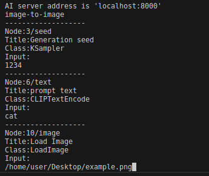

# 🎨 Client test
Bridge server를 사용하는 client의 예시입니다.

# 📌 Index
- [Preparation](#-preparation)
- [Test all at once](#-test-all-at-once)
- [Test ones by ones](#-test-ones-by-ones)
## 📝 Preparation
1. `Bridge-server-for-comfyui/bridge_server/workflows`에 ComfyUI workflow 추가

    ex: your_awesome_workflow.json
2. `Bridge-server-for-comfyui/bridge_server/workflow_alias.json`에서 workflow alias 설정
    
    ex: "awesome_alias":"your_awesome_workflow.json"
3. `Bridge-server-for-comfyui/bridge_server/test_wf_names.txt`에 테스트 workflow alias 추가

    ex: awesome_alias
## 🚀 Test all at once
1. client 경로로 이동
    ```bash
    cd Bridge-server-for-comfyui/client
    ```
2. test 코드 실행
    - use websocket
        ```bash
        python3 ws_example.py --test
        ```
    - use REST API
        ```bash
        python3 rest_example.py --test
        ```
    - 일괄 test시 **default input 파일들이 모두 ComfyUI input 디렉토리에 존재하여야 합니다.** 기본적인 example 파일들은 `Bridge-server-for-comfyui/patch.py` 실행할 때 생성됩니다.
## 🧩 Test ones by ones
1. client 경로로 이동
    ```bash
    cd Bridge-server-for-comfyui/client
    ```
2. test 코드 실행
    - use websocket
        ```bash
        python3 ws_example.py --wfs "text-to-image","image-to-image"...
        ```
    - use REST API
        ```bash
        python3 rest_example.py --wfs "text-to-image","image-to-image"...
        ```
3. 코드 실행 후 터미널이 요구하는 input을 입력하세요. 아래와 같이 **파일을 요구할 경우, 해당 파일의 경로를 입력**해주세요.
    